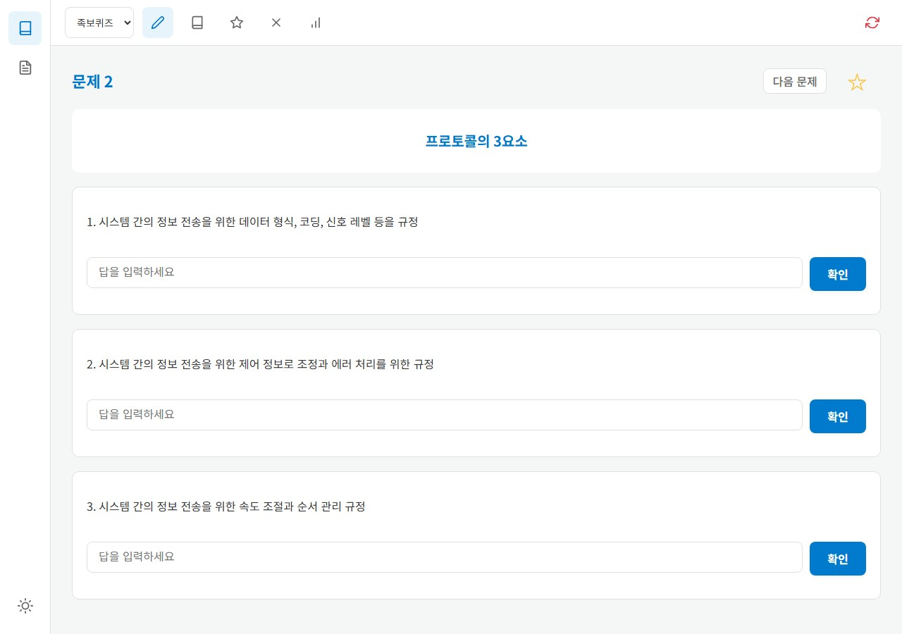
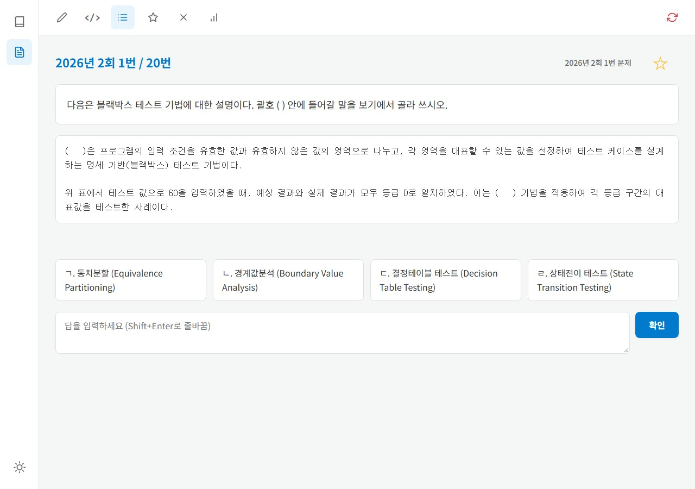
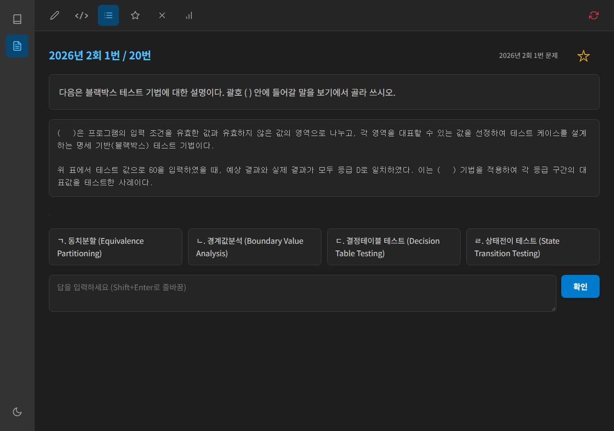

# 정보처리기사 실기 퀴즈 앱 (EIP Practice)

[Vue 3](https://vuejs.org/)와 [Vite](https://vitejs.dev/)를 사용하여 구축한 정보처리기사 실기 대비용 퀴즈 애플리케이션입니다.

## 자료 출처
- [[2026년 대비] 핵심 키워드만 암기하면 쉽게 기억되는 키워드 찾기 130문제](https://www.sinagong.co.kr/pds/001001002/past-exams)
- [정보처리기사 실기 족보 1탄](https://chobopark.tistory.com/193)
- [정보처리기사 실기 족보 2탄](https://chobopark.tistory.com/197)
- [정보처리기사 실기 기출문제 2022년 1회](https://chobopark.tistory.com/271)
- [정보처리기사 실기 기출문제 2022년 2회](https://chobopark.tistory.com/423)
- [정보처리기사 실기 기출문제 2022년 3회](https://chobopark.tistory.com/424)
- [정보처리기사 실기 기출문제 2023년 1회](https://chobopark.tistory.com/372)
- [정보처리기사 실기 기출문제 2023년 2회](https://chobopark.tistory.com/420)
- [정보처리기사 실기 기출문제 2023년 3회](https://chobopark.tistory.com/453)
- [정보처리기사 실기 기출문제 2024년 1회](https://chobopark.tistory.com/476)
- [정보처리기사 실기 기출문제 2024년 2회](https://chobopark.tistory.com/483)
- [정보처리기사 실기 기출문제 2024년 3회](https://chobopark.tistory.com/495)
- [정보처리기사 실기 기출문제 2025년 1회](https://chobopark.tistory.com/540)
- [정보처리기사 실기 기출문제 2025년 2회](https://chobopark.tistory.com/554)
- [정보처리기사 실기 기출문제 2025년 3회](https://chobopark.tistory.com/558)
- [정보처리기사 실기 기출문제 2026년 1회](https://chobopark.tistory.com/561)
- [정보처리기사 실기 기출문제 2026년 2회](https://chobopark.tistory.com/562)

## 스크린샷

| 족보퀴즈 | 기출문제 | 다크모드 |
|:---:|:---:|:---:|
|  |  |  |

## 기술 스택

[](https://vuejs.org/)
[](https://vitejs.dev/)
[](https://developer.mozilla.org/ko/docs/Web/JavaScript)

## 실행 방법

```bash
npm install
npm run dev
```

- 검증은 `npm test`, 배포용 빌드는 `npm run build`로 실행합니다.
- Windows PowerShell 실행 정책으로 `npm`을 실행할 수 없는 경우 `npm.cmd`를 사용합니다.
